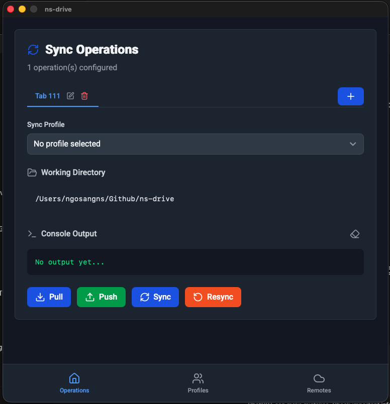

# NS-Drive

A modern desktop application for cloud storage synchronization powered by rclone. NS-Drive provides an intuitive GUI for managing cloud remotes and sync profiles with real-time operation monitoring.

## 🚀 Features

- **Multi-Cloud Support**: Connect to Google Drive, Dropbox, OneDrive, Yandex Disk, Google Photos, iCloud Drive, and more
- **Profile Management**: Create and manage sync profiles with custom configurations
- **Real-time Monitoring**: Live output streaming and progress tracking for sync operations
- **Multi-tab Operations**: Run multiple sync operations simultaneously in separate tabs
- **Dark Mode**: Modern dark/light theme with responsive design
- **Cross-platform**: Available for Windows, macOS, and Linux

## 🛠️ Technology Stack

- **Backend**: Go 1.23.4 with Wails v3 framework
- **Frontend**: Angular 20.0.6 with Tailwind CSS
- **Cloud Sync**: rclone integration
- **Package Manager**: Yarn 4.9.2
- **Build Tool**: Taskfile (task runner)

## 📋 Prerequisites

Before building or running NS-Drive, ensure you have the following installed:

- **Go**: v1.23.4 or later
- **Node.js**: v18 or later
- **Yarn**: v4.9.2 (package manager)
- **Taskfile**: Task runner for build automation
- **Wails v3**: Desktop app framework

### Installing Prerequisites

```bash
# Install Go (if not already installed)
# Visit: https://golang.org/dl/

# Install Node.js and Yarn
# Visit: https://nodejs.org/
npm install -g yarn

# Install Taskfile
# Visit: https://taskfile.dev/installation/

# Install Wails v3
go install github.com/wailsapp/wails/v3/cmd/wails3@latest
```

## 🏗️ Building the Application

### Development Mode

```bash
# Option 1: Two-terminal setup (recommended)
# Terminal 1: Start frontend dev server
task dev:frontend

# Terminal 2: Start Wails dev server (with hot reload)
task devs

# Option 2: Single command (experimental)
task dev:full

# Option 3: Simple development mode (no hot reload)
task dev
```

### Production Build

#### macOS

```bash
task build
# Creates: desktop.app in project root
```

#### Windows

```bash
task build
# Creates: desktop.exe in project root
```

#### Linux

```bash
task build
# Creates: desktop binary in project root
```

## 🚀 Quick Start

1. **Clone the repository**

   ```bash
   git clone <repository-url>
   cd ns-drive
   ```

2. **Install dependencies**

   ```bash
   task install:frontend:deps
   ```

3. **Run in development mode**

   ```bash
   # Start frontend dev server (Terminal 1)
   task dev:frontend

   # Start Wails dev server (Terminal 2)
   task devs
   ```

4. **Build for production**

   ```bash
   task build
   ```

5. **Run the application**
   - Execute `./desktop.app` (macOS) or `./desktop.exe` (Windows) from the project root

## 📖 Usage Guide

### Setting Up Cloud Remotes

1. **Open NS-Drive application**
2. **Navigate to Remotes section**
3. **Click "Add Remote" button**
4. **Select your cloud provider**
5. **Follow the authentication flow**

### Creating Sync Profiles

1. **Go to Profiles section**
2. **Click "Add Profile" button**
3. **Configure sync settings**:
   - Select remote and local paths
   - Set sync direction (pull/push/bi-sync)
   - Configure bandwidth and parallel transfers
   - Add include/exclude patterns

### Running Sync Operations

1. **Navigate to Home dashboard**
2. **Create a new operation tab**
3. **Select a profile to run**
4. **Monitor real-time progress**
5. **Manage multiple operations simultaneously**

## 🔧 Available Commands

| Command                      | Description                                                 | Status          |
| ---------------------------- | ----------------------------------------------------------- | --------------- |
| `task build`                 | Build the application for current platform                  | ✅ Working      |
| `task package`               | Package the application for distribution                    | ⚠️ Experimental |
| `task run`                   | Run the built application                                   | ✅ Working      |
| `task dev`                   | Run in development mode                                     | ✅ Working      |
| `task devs`                  | Run with Wails v3 dev server (requires frontend dev server) | ✅ Working      |
| `task dev:full`              | Start both frontend and backend dev servers                 | ⚠️ Experimental |
| `task install:frontend:deps` | Install frontend dependencies                               | ✅ Working      |
| `task build:frontend`        | Build frontend for production                               | ✅ Working      |
| `task dev:frontend`          | Build frontend with watch mode                              | ✅ Working      |
| `task generate:bindings`     | Generate TypeScript bindings                                | ✅ Working      |
| `task clean`                 | Clean build artifacts                                       | ✅ Working      |
| `task fmt`                   | Format Go code                                              | ✅ Working      |
| `task test`                  | Run tests                                                   | ✅ Working      |

## 🌐 Supported Cloud Providers

- **Google Drive** - Full read/write access
- **Dropbox** - Complete file synchronization
- **OneDrive** - Microsoft cloud storage
- **Yandex Disk** - Russian cloud service
- **Google Photos** - Photo library backup (read-only)
- **iCloud Drive** - Apple cloud storage
- **And many more** - Any provider supported by rclone

For detailed setup instructions for each provider, see [Cloud Providers Documentation](docs/CLOUD_PROVIDERS.md).

## 📱 Screenshots

### Dashboard


_Multi-tab operation dashboard with real-time monitoring_

### Profile Management


_Create and configure sync profiles with advanced settings_

### Remote Configuration


_Manage cloud storage connections and authentication_

## 🏗️ Project Structure

```
ns-drive/
├── desktop/                 # Main application directory
│   ├── backend/            # Go backend code
│   │   ├── app.go         # Main application logic
│   │   ├── commands.go    # Sync operations
│   │   ├── models/        # Data structures
│   │   └── rclone/        # rclone integration
│   ├── frontend/          # Angular frontend
│   │   ├── src/app/       # Application components
│   │   └── dist/          # Built frontend assets
│   └── build/             # Build configuration
├── docs/                  # Documentation
├── screenshots/           # Application screenshots
├── Taskfile.yml          # Build tasks
└── README.md             # This file
```

## 🤝 Contributing

1. Fork the repository
2. Create a feature branch
3. Make your changes
4. Run tests: `task test`
5. Submit a pull request

## 📄 License

This project is licensed under the MIT License - see the LICENSE file for details.

## 🐛 Troubleshooting

### Common Issues

1. **Build failures**: Check Go/Node versions and dependencies
2. **Sync errors**: Verify remote configuration and permissions
3. **UI freezing**: Check for blocking operations on main thread
4. **Memory leaks**: Ensure proper cleanup of subscriptions

### Debug Commands

```bash
# Enable debug mode with hot reload
task devs

# Run backend tests
task test

# Check code formatting
task fmt

# Clean and rebuild
task clean && task build

# Generate TypeScript bindings
task generate:bindings

# Install frontend dependencies
task install:frontend:deps
```

### Common Issues & Solutions

1. **Build fails with "no matching files found"**

   ```bash
   # Solution: Build frontend first
   task build:frontend
   task build
   ```

2. **Dev server fails to start**

   ```bash
   # Solution: Start frontend dev server first
   # Terminal 1:
   task dev:frontend

   # Terminal 2:
   task devs
   ```

3. **Wails3 command not found**

   ```bash
   # Solution: Install Wails v3
   go install github.com/wailsapp/wails/v3/cmd/wails3@latest
   ```

4. **Frontend dependencies missing**

   ```bash
   # Solution: Install dependencies
   task install:frontend:deps
   ```

5. **Linker warnings about macOS version**

   ```
   ld: warning: object file was built for newer 'macOS' version (16.0) than being linked (12.0)
   ```

   These warnings are harmless and don't affect functionality. They occur because the Go compiler targets a newer macOS version than the minimum deployment target (macOS 12.0 Monterey). The warnings should be minimal with the current deployment target.

For more detailed troubleshooting, see [RULES.md](RULES.md).

## 📞 Support

- **Documentation**: Check [RULES.md](RULES.md) for detailed project information
- **Cloud Setup**: See [Cloud Providers Guide](docs/CLOUD_PROVIDERS.md)
- **Issues**: Report bugs and feature requests via GitHub Issues

---

**NS-Drive** - Simplifying cloud storage synchronization with a modern, intuitive interface.
